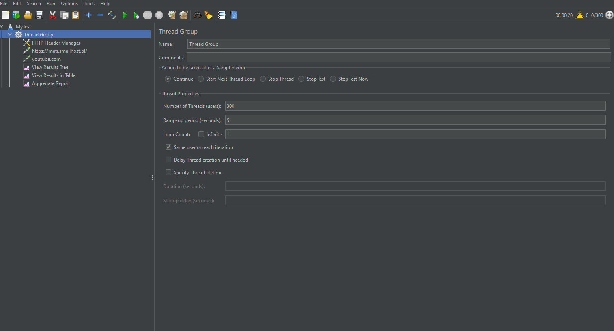
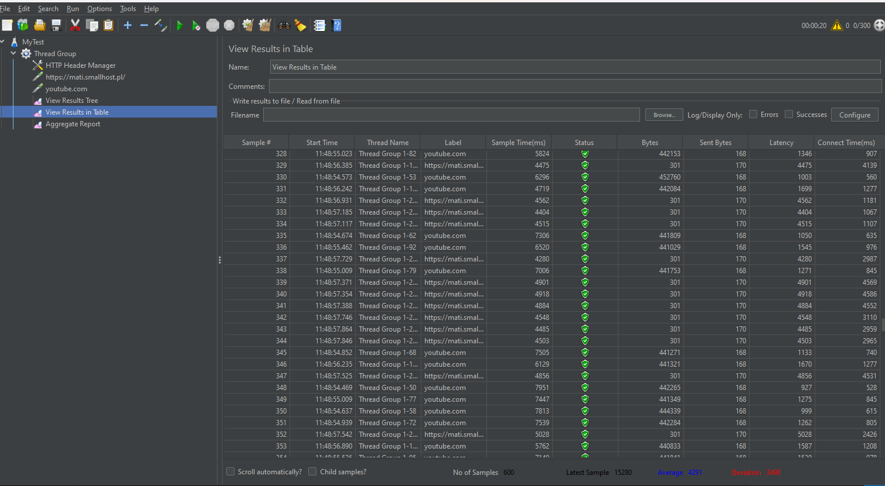
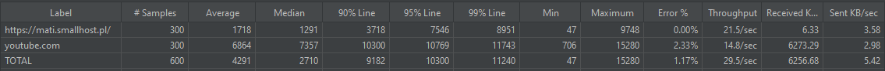

# Analiza Wydajności Aplikacji - Raport

## Wprowadzenie

Ten raport prezentuje wyniki testów wydajności aplikacji przeprowadzonych przy użyciu Apache JMeter.   Testy obejmują dwa scenariusze:  
 dostęp do strony https://mati.smallhost.pl/ oraz YouTube.

## Tabela Wyników

| Label                | # Samples | Average | Median | 90% Line | 95% Line | 99% Line | Min | Max  | Error % | Throughput | Received KB/sec | Sent KB/sec |
|----------------------|-----------|---------|--------|----------|----------|----------|-----|------|---------|------------|-----------------|-------------|
| https://mati.smallhost.pl/ | 300       | 1718    | 1291   | 3718     | 7546     | 8951     | 47  | 9748 | 0.000%  | 21.54553   | 6.33            | 3.58        |
| youtube.com          | 300       | 6864    | 7357   | 10300    | 10769    | 11743    | 706 | 15280| 2.333%  | 14.77541   | 6273.29         | 2.98        |
| TOTAL                | 600       | 4291    | 2710   | 9182     | 10300    | 11240    | 47  | 15280| 1.167%  | 29.45219   | 6256.68         | 5.42        |

## Screeny

### 1. Konfiguracja Thread Group

### 2. Tabela

### 3. Aggregate

## Wnioski

1. **https://mati.smallhost.pl/**
   - Aplikacja działa stabilnie, średni czas odpowiedzi wynosi 1718 ms, a błąd wynosi 0.000%.
   - Throughput utrzymuje się na zadowalającym poziomie, co wskazuje na dobrą wydajność.
   - Aplikacja nie zwróciła żadnego błędu więc nie przestaje odpowiadać

2. **youtube.com**
   - Aplikacja wykazuje wyższy czas odpowiedzi, zwłaszcza w przypadku 99% Line, co może wpływać na doświadczenie użytkownika.
   - Mimo tego, błąd wynosi tylko 2.333%, co jest akceptowalne.
   - Aplikacja przestaje odpowiadać, po kilku zapytaniach pod rząd, może to być spowodowane zabezpieczeniami youtube przed atakami

3. **Ogólnie (TOTAL)**
   - Łączna wydajność obu scenariuszy testowych jest satysfakcjonująca, z wyjątkiem pewnych przypadków na youtube.com.
   - Throughput utrzymuje się na akceptowalnym poziomie, ale warto monitorować ewentualne zmiany w przyszłości.

## Potencjalne Anomalie

1. **youtube.com - Wyższy czas odpowiedzi**
   - Warto monitorować średni czas odpowiedzi, zwłaszcza dla youtube.com. Dłuższe czasy odpowiedzi mogą wpływać na doświadczenie użytkowników.

2. **Error Percentage**
   - Nawet niewielki wzrost w procentach błędów może sygnalizować problemy z dostępnością lub stabilnością aplikacji. Należy śledzić wszelkie zmiany w tym wskaźniku.

3. **Throughput**
   - Spadek throughput może wskazywać na obciążenie aplikacji. Warto zidentyfikować przyczyny i dostosować zasoby serwera, aby utrzymać stabilną wydajność.

## Zakończenie

Podsumowując, aplikacja https://mati.smallhost.pl/ wydaje się działać poprawnie, natomiast youtube.com wykazuje pewne obszary do optymalizacji.